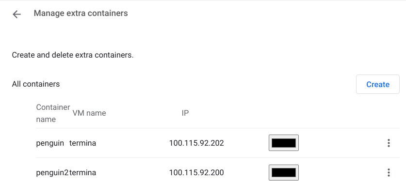
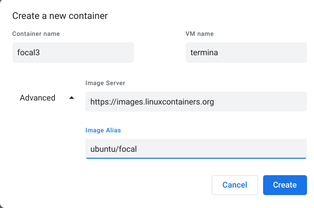

# Tips for running linux containers (LXC) on ChromeOS via Crostini  

[Crostini](https://chromeos.dev/en/linux) is a system for running Linux in [LXC](https://linuxcontainers.org/lxc/introduction/) containers on the Chrome OS operating system. LXC containers provide the user with a full operating environment, including a command-line shell; and optionally, a graphical user interface. Crostini was designed with a focus on insulating Chrome OS from security threats coming from inside the containers. This is great for developers who want a secure, managed, operating system; while also having access to a linux development environment.

LXC containers are similar to virtual machines, except that LXC containers are less demanding on resources (CPU, memory) because they share the system kernel amongst multiple containers. Whereas virtual machines virtualize an entire physical system, including the kernel. LXC containers differ from Docker containers, in that Docker is mainly used to virtualize single applications, like a web-server, rather than a whole interactive operating environment.  

Crostini's architecture is complex. There are several layers of virtualization technologies nested within each other; as well as control channels that traverse layers. The Chrome OS setup instructions are sufficient for basic operation. However, understanding the architecture and terminology is helpful for making use of the more advanced features, and troubleshooting in the event something breaks. 

### Chrome OS vs Chromium OS and Open Source Software

Chromium OS is an Open Source Software project [founded by Google](https://blog.chromium.org/2009/12/whats-difference-between-chromium-os.html). Software contributors, including Google employees in their professional capacities, contribute to Chromium OS. Google then pulls from the Chromium OS source tree to build their commercial Chrome OS products. The Chromium web browser operates on an identical model, being the underlying source code for Google's Chrome browser. For simplicity, we will refer to Chrome OS and Chrome browser.

## Quickstart Guide  
Crostini runs well without any major configuration. If you just want to get started running Linux on your Chrome OS device, the [instructions](https://chromeos.dev/en/linux/setup) from Google are good. Chrome OS devices from 2019 onwards generally support Crostini. If your device is older, you can check if it is [supported](https://sites.google.com/a/chromium.org/dev/chromium-os/chrome-os-systems-supporting-linux). If your Chrome OS device is controlled by an educational organization, Crostini may have been disabled.

Before following the Google install directions, one small improvement is to go into the Chrome browser and type `chrome://flags#crostini-multi-container` in the address bar, and enable this feature. As of Chrome version 98, on the Beta channel, this enables some additional options in the user interface to manage multiple linux instances.

## Crostini Architecture Overview


This architecture diagram from the [Crostini Developer Guide](https://chromium.googlesource.com/chromiumos/docs/+/HEAD/crostini_developer_guide.md) is helpful for understanding Crostini's various subsystems and how they interact. It should be read in tandem with [Running Custom Containers Under Chrome OS](https://chromium.googlesource.com/chromiumos/docs/+/HEAD/containers_and_vms.md), where the Overview sections gives a concise description of each of the subsystems. The following description is intended as a reference you can come back to, and may make more sense after getting some experience with running LXC linux containers.

On this chart, virtualization boundaries are represented with rounded corners (CrOS, Termina VM, Debian Container). Services and daemons are represented with square boxes. Communication channels are represented with solid lines. The dashed lines appear to represent a launch or initialization rather than a persistent communication channel. Note `maitred pid 1` is the only service/daemon with a dashed outline. This appears to reflect its unique position as an "agent", which can be discussed later.

CrOS is Chrome OS, the host's operating system (light blue background). Termina VM (pink background) is a special, read-only, virtual machine instance that runs the LXD software that manages the LXC containers. Note it is the name of a virtual machine instance, rather than a service. In traditional terms it can be referred to as a "guest operating system." Debian Container (light yellow background) is an LXC container. The default LXC container is named Penguin. User-launched containers would be represented alongside Debian Container, as independent instances .

Two important pieces, not pictured, are [crosh](https://chromium.googlesource.com/chromiumos/platform2/+/HEAD/crosh) and [crosvm](https://google.github.io/crosvm/). Crosh is a limited command-line shell that  runs directly on Chrome OS. Crossvm is a "virtual machine monitor". In more traditional terms it can be thought of as a [type-2](https://en.wikipedia.org/wiki/Hypervisor#Classification) hypervisor. Crossvm is the execution environment for the special Termina virtual machine.

The nesting hierarchy of the various virtualization environments can be confusing. This tree shows the relationships.    

```
Chrome OS (Host Operating System)
  ├── Chrome (Browser process)
  ├── Crosh (Command-line Shell)
  └── CrosVM (Hypervisor)
      └── Termina VM (Guest Virtual Machine instance)
          └── LXD (Daemon)
              ├── Penguin LXC (Container)
              └── LXC 2 (Optional user-specified container)
```
[Garcon](https://chromium.googlesource.com/chromiumos/platform2/+/HEAD/vm_tools/garcon/), [Sommelier](https://chromium.googlesource.com/chromiumos/platform2/+/HEAD/vm_tools/sommelier/),and [Vshd](https://chromium.googlesource.com/chromiumos/platform2/+/HEAD/vm_tools/vsh/) (yellow) are daemons that run inside LXC containers. They are installed with the [cros-continer-guest-tools](https://chromium.googlesource.com/chromiumos/containers/cros-container-guest-tools/+/refs/heads/main) package. They cross the isolation boundary of the LXC container and the virtual machine. This enables users to use the Chrome OS user interface to control LXC containers.

This should be enough of an architecture understanding for intermediate-level running and troubleshooting of LXC containers. The following advanced section is included so that there is a complete explanation of the architecture diagram in one place. 

### Crostini Architecture Overview (Advanced)
There are a couple of flavors of communication channel: [D-Bus](https://chromium.googlesource.com/chromiumos/platform2/+/HEAD/vm_tools/dbus/), [gRPC](https://chromium.googlesource.com/chromiumos/platform2/+/HEAD/vm_tools#wire-format), [REST API over unix socket](https://chromium.googlesource.com/chromiumos/platform/tremplin/+/HEAD/src/chromiumos/tremplin?autodive=0/), and [Vsock](https://chromium.googlesource.com/chromiumos/platform2/+/master/vm_tools/vsh). Most of the messages passing through these channels are [protobuf](https://chromium.googlesource.com/chromiumos/platform2/+/HEAD/vm_tools/proto) format.

[Seneschal](https://chromium.googlesource.com/chromiumos/platform2/+/HEAD/vm_tools/seneschal/) uses the [Plan 9 Filesystem Protocol](https://chromium.googlesource.com/chromiumos/platform2/+/HEAD/vm_tools/9s/) to share a Chrome OS user's files (i.e. Downloads) with virtual machines (i.e. Termina), which are then mounted into a user's home directory in the LXC container.

[Concierge](https://chromium.googlesource.com/chromiumos/platform2/+/HEAD/vm_tools/concierge) is responsible for starting, stopping, and tracking virtual machines. It communicates to Chrome OS over [d-bus](https://chromium.googlesource.com/chromiumos/platform/system_api/+/HEAD/dbus/vm_concierge/).

[Cicerone](https://chromium.googlesource.com/chromiumos/platform2/+/HEAD/vm_tools/cicerone/) is responsible for communicating with containers. It talks to the [Garcon] service, installed by cros-guest-tools in LXC containers. It communicates to Chrome OS over [d-bus](https://chromium.googlesource.com/chromiumos/platform/system_api/+/HEAD/dbus/vm_cicerone)

[Vmlog_forwarder and vm_syslog](https://chromium.googlesource.com/chromiumos/platform2/+/HEAD/vm_tools/docs/logging.md) work together to capture logs from virtual machines and store them in Chrome OS.

[Tremplin](https://chromium.googlesource.com/chromiumos/platform/tremplin/+/refs/heads/main) Translates gRPC between Cicerone on the host and LXD in the VM.

## Directly Managing LXC Containers
Now that you understand the basic Crostini architecture, directly managing LXC containers will make more sense. The basic workflow is:
* Open Crosh, with the `Ctrl+Alt+T` shortcut. Or by navigating to `chrome-untrusted://crosh` in Chrome.
* At the `crosh>` shell prompt type `vmc launch termina`
* Your shell prompt should change to `(termina) chronos@localhost`, and you are now logged into the virtual machine named `termina`.
* From this `termina` shell prompt you have access to the `lxc` command, where you can create and manage LXC containers.
* From the `crosh` shell prompt you can launch lxc containers that you have created via `vmc termina <container name>` 
* For best integration into Chrome OS, it is strongly recommended that you install the [cros-continer-guest-tools](https://chromium.googlesource.com/chromiumos/containers/cros-container-guest-tools/+/refs/heads/main)

Crostini is under active development as of Feb 2022. There are ways to get the LXC containers into bad states. For example if you are starting and stopping containers via one interface (LXC or graphical interface), their state may not be picked up by the other interfaces.

## Using the Multi-Container User Interface to Manage LXC Containers
Depending on your version of Chrome OS (Chrome OS ver. 98 beta channel confirmed working) you may be able to access the "Manage Extra Containers" option under Advanced > Linux Development Environment. To enable this feature:
* In Chrome type `chrome://flags#crostini-multi-container` and enable the feature.
* Restart your Chrome OS device.
* If your device supports the multi-container feature, you will see an interface similar to:



At this point you have a pretty powerful setup. You can start/stop create/delete default LXC containers from this UI. From the desktop you can right-click (Alt-click) on the Terminal application, to choose which LXC container to connect to.

Crostini is under active development as of Feb 2022. There are ways to get the LXC containers into bad states. For example if you are starting and stopping containers via one interface (LXC or graphical interface), their state may not be picked up by the other interfaces.

## Running Custom LXC containers.
There are several places where you can download pre-made LXC images, and run them directly. This requires placing a lot of trust in a third party that nothing malicious has slipped into those images. A user can also build their own LXC images using a variety of tools.

Historically the tool to use was [lxc-templates](https://github.com/lxc/lxc-templates), which is available in most distributions' package manager. Presently, the LXC project recommends using [distrobuilder](https://github.com/lxc/distrobuilder)

## cros-container-guest-tools
The [cros-continer-guest-tools](https://chromium.googlesource.com/chromiumos/containers/cros-container-guest-tools/+/refs/heads/main) enable communication between an LXC container and the Chrome OS operating system, traversing the virtual machine boundary. On a default installation, these tools are installed by attaching a virtual disk inside the LXC container and mounting it at `/opt/google/cros-containers`. [lxd_setup.sh](https://chromium.googlesource.com/chromiumos/containers/cros-container-guest-tools/+/refs/heads/main/lxd/lxd_setup.sh) is run when the container is first created, which installs the `cros-guest-tools`. The guest tools are started in the lxc container via systemd unit files in `/etc/systemd/users/`.

For best integration into Chrome OS, it is strongly recommended that you install these tools.

### Debian, Ubuntu or apt/.deb package managers.
* Add appropriate apt repo key - https://www.google.com/linuxrepositories/
* Add Google's repository to your system. Look at `/etc/apt/sources.list.d/crost.list` on your default Penguin LXC, and create an identical file and contents on your new install.
* Do `apt install cros-guest-tools`  

### Redhat or .RPM based package managers
https://centos.pkgs.org/8/epel-x86_64/cros-guest-tools-1.0-0.39.20200806git19eab9e.el8.noarch.rpm.html

### Arch Linux (reported broken)
https://aur.archlinux.org/packages/cros-container-guest-tools-git/

## Installing Ubuntu as a custom LXC Container
Ubuntu is based on Debian, just like the default Penguin container. As such, the `cros-guest-tools` .deb installer mostly works. Sommelier doesn't install, so Wayland/GUI apps don't work, but you can get the integration with the default Terminal app working for a usable command-line experience.

You can use Advanced > Developers > Linux Development Enviornment > Manage extra containers > Create dialog to get started.



Verify that the container started, by opening Termina and executing `lxc list`, where you should see your container running. Execute `lxc exec <container name> -- /bin/bash`, which should give you a root prompt inside your container.

In that container:
```
apt update
apt upgrade -y
apt install -y wget gpg
wget -q -O - https://dl.google.com/linux/linux_signing_key.pub | apt-key add -
echo "deb https://storage.googleapis.com/cros-packages/98 bullseye main" > /etc/apt/sources.list.d/cros.list"
apt update
apt install -y cros-guest-tools
```
At some point this install will fail. Possibly on the `cros-ui-config` package. This appears related to the Chromium OS Sommelier package which provides the Wayland service for graphical apps.

Shutdown the container with `shutdown -P now`

In the `termina` virtual machine, you can verify the container is stopped with `lxc list`. Exit out of `termina` and in the `crosh` shell execute `vmc container termina <container name>`

On my system this immediately dropped me into a shell as user `ubuntu` on the lxc container. SystemD had started the garcon daemon, and right-clicking (alt-clicking) on the Terminal app allowed me to open a shell into the container. The container was also able to be stopped and deleted via the Manage Extra Containers dialog. The container was available across reboots, and just needed to be re-started via the Terminal app. 

Further research can be done into de-coupling the gui and sound bits from the `cros-guest-tools` .deb meta-package, and only installing those guest extensions needed for a minimal Ubuntu install.

Possible workarounds to GUI issue:  
https://github.com/quack1-1/scripts  
https://github.com/pitastrudl/wekanwiki/blob/master/Chromebook.md#5-install-crostini-packages  
https://github.com/LukeShortCloud/rootpages/blob/main/src/linux_distributions/chromium_os.rst  

## Installing Red Hat Linux distributions.

## Advanced LXC container operations

lxc list (defaults to containers)

lxc config show <container name>

lxc profile, lxc profile show <default>

lxc remote list

If you launch an image that you don't have locally, it will first download it. To avoid this you can cp it locally first. be sure to --copy-aliases

`lxc image copy <source remote>:<alias> <destination remote>: --copy-aliases`
`lxc image copy images:focal local: --copy-aliases`

Adding a new remote:

lxc info --resources (information about running server)
for more info, append --debug

Any number of profiles can be applied to a container. So you could have one that handles networking, another that handles mounts, etc.


## Networking
Under Settings > Advanced > Linux Development Environment, you can forward ports to the LXC containers.

Todo: SSH access

## Files Access
By default a folder called `Linux Files` is created in Chrome OS, and this is mapped to the user's home directory in the LXC containers.

Additionally, you can select folders in the Chrome OS `Files` app, via right-click, to be shared into LXC containers.

## USB
Under Settings > Advanced > Linux Development Environment you can choose to pass USB devices through to the LXC containers.

## Chrome OS internals
For advanced troubleshooting, low-level development, or curiosity; one might wish to understand how Chrome OS works behind the scense. Especially considering that there appears to be some "magic" configuration of LXC containers.

It is possible to put a Chrome OS device into Developer Mode, by holding down ESC+Refresh while powering up the device. You will be prompted with warnings that continuing will wipe user data off the device. Once you complete the Chrome OS device setup, you can enter CRoSH shell (Ctrl+Alt+T) and then type `shell` to log into a non-virtualized, "bare-metal" shell on the device. You should see a prompt of `chronos@localhost`. The `chronos` user has sudo privileges.

Chrome OS uses [Upstart](https://www.chromium.org/chromium-os/chromiumos-design-docs/boot-design/) as it's initialization (init) system. System configuration is stored in `/etc/init/`, and `/sbin/initctl` can be used to qquery the state of services. By default neither `/sbin` or `/usr/sbin` are in `$PATH`, although you will find useful executables there.

The command `ps aux --forest` is useful in seeing how the running system is organized. You can see user, process, and child-process information.

The control virtual machine, named Termina is loaded from `/run/imageloader/termina-dlc/package/root/`

## Sharing Chrome OS files into an LXC container
Doing this from within Chrome OS is simple. In the Files app you right click a folder and select "Share with Linux." You can see shared folders in Settings > Advanced > Linux Development Environment > Manage Shared Folders.

The mechanism that accomplishes this is complex. The Chrome OS UI interacts with [Seneschal](https://chromium.googlesource.com/chromiumos/platform2/+/HEAD/vm_tools#seneschal) over dbus and shares a narrowly scoped file system object with the virtual machine.

[Containers_and_vms.md](https://chromium.googlesource.com/chromiumos/docs/+/HEAD/containers_and_vms.md#Overview)
```
Seneschal is a daemon that runs in Chrome OS that handles lifecycle management of 9P servers. When Concierge starts a VM, it sends a message to Seneschal to also start a 9s instance for that VM. Then, while configuring the VM, Concierge sends a message to Maitred instructing it to connect to the 9s instance and mount it inside the VM.
```
 This file system object is then somehow mapped into the LXC containers. It is unclear which of the several services maps the file system object from the virtual machine into the LXC container.

Presumably the commands to mount files into the container should be in protobufs definitions, but I cannot find anything.
https://chromium.googlesource.com/chromiumos/platform2/+/HEAD/vm_tools/proto

Tremplin seems like a likely candidate, it has a communications channel to the Operating system via [Cicerone](https://chromium.googlesource.com/chromiumos/platform2/+/HEAD/vm_tools/cicerone/container.cc#45) And there are references elsewhere in the code about Tremplin doing [file operations](https://chromium.googlesource.com/chromiumos/containers/cros-container-guest-tools/+/refs/heads/main/lxd/lxd_setup.sh#35) inside containers.

[Maitrid](https://chromium.googlesource.com/chromiumos/platform2/+/HEAD/vm_tools#maitred) is also a potential candidate for mapping file systems from the OS into containers.

This complexity is likely a result of the security philosophy underpinning Crostini. The security features around anything crossing security boundaries is strict. In this case there are strict processes around sharing files between host and containers.

[Garcon README.md](https://chromium.googlesource.com/chromiumos/platform2/+/HEAD/vm_tools/garcon/#garcon)
```
Garcon receives a token from the host which is used to identify itself in all communication back to the host. This is bind-mounted into the container from the VM.
```

It is possible that the host mounts the filesystem into the VM, and also pushes the availability of the filesystem to Garcon, which then could mount it in the container. Alterantely, it is possible the host mounts the filesystem into the VM, and then via Tremplin, tells LXD to make the filesystem available into the container.

There is a sshfs running in Chrome OS fuse:sshf://<user>@penguin.termina.linux.test. It is possible that ~/home is served as an SSHFS over vsock, where other shared files are served via 9s to /mnt/chromeos. The `.test` suffix may indicate this is just a way to test ssh keys by checking for a file however.

## Troubleshooting
* If you are working off of tutorials, check that they are somewhat recent, Chrome OS/Crostini are developing rapidly.
* A list of useful Chrome OS URLS is available in your browser via `chrome://chrome-urls`
`
* If Linux Developer Options do not appear or the multiple container UI doesn't appear, try restarting the system. Or try disabling and re-enabling the crostini-multi-container flag, or linux development environment.

### Userful Chrome URLs
`chrome://chrome-urls`  
`chrome://system#crostini`  
`chrome://system#crosvm.log`  

## Notes
This is a selection of useful links, it is not meant to be exhaustive.

### Chrome OS Fundamentals
https://www.chromium.org/chromium-os/  
https://www.chromium.org/chromium-os/chromiumos-design-docs/  
https://chromium.googlesource.com/chromiumos/docs/+/refs/heads/main  
https://chromium.googlesource.com/chromiumos/docs/+/HEAD/costini_developer_guide.md  
https://chromium.googlesource.com/chromiumos/docs/+/HEAD/containers_and_vms.md  
https://chromium.googlesource.com/chromiumos/platform2/+/HEAD/vm_tools/docs/logging.md  
https://chromium.googlesource.com/chromiumos/docs/+/HEAD/security/chromeos_security_whitepaper.md  
https://chromium.googlesource.com/chromium/src/+/main/chrome/browser/ash/crostini  
https://chromium.googlesource.com/chromiumos/docs/+/refs/heads/main/reporting_bugs.md#logs  
https://chromium.googlesource.com/chromiumos/platform2/+/HEAD/vm_tools/vsh/  
https://www.chromium.org/chromium-os/chromiumos-design-docs/boot-design/  

### Chrome OS Internals
https://chromium.googlesource.com/chromiumos/docs/+/HEAD/dbus_in_chrome.md  
https://www.chromium.org/developers/mus-ash/ - discontinued 2019  
https://chromium.googlesource.com/chromiumos/platform2/+/HEAD/crosh/src/base/vmc.rs  
https://chromium.googlesource.com/chromiumos/platform2/+/HEAD/vm_tools/docs/init.md  
https://chromium.googlesource.com/chromiumos/platform2/+/HEAD/vm_tools/init/vm_concierge.conf - nsenter details  
https://blog.simos.info/a-closer-look-at-chrome-os-using-lxd-to-run-linux-gui-apps-project-crostini/  
https://chromium.googlesource.com/chromiumos/containers/cros-container-guest-tools/+/refs/heads/main/lxd/lxd_setup.sh#35 -Confirms that Tremplin writes /etc/apt/sources.d/cros.list (Possible also writes systemd unit files then?)  

### Using Crostini
https://github.com/edeloya/ChromeOS-Terminal-LXC-LXD  
https://wiki.archlinux.org/title/Chrome_OS_devices/Crostini

### LXD / LXC 
https://medium.com/@tcij1013/lxc-lxd-cheetsheet-effb5389922d  
https://wiki.debian.org/LXC  
https://stgraber.org/2016/03/11/lxd-2-0-blog-post-series-012/  
https://linuxcontainers.org/lxd/docs/master/authentication/
https://www.turnkeylinux.org/lxc  
https://wiki.alpinelinux.org/wiki/LXC
https://wiki.archlinux.org/title/LXD#Create_a_container
https://wiki.debian.org/LXC
https://www.buzzwrd.me/index.php/2021/03/10/creating-lxc-containers-from-docker-and-oci-images/

### Yubikey
https://blog.merzlabs.com/posts/crostini-now-usable/  
https://blog.merzlabs.com/posts/yubikey-crostini/  

## Source code for reference
https://source.chromium.org/  
https://chromium.googlesource.com/chromiumos/platform2/  
https://chromium.googlesource.com/chromiumos/platform/crosvm/  
https://github.com/google/crosvm  

https://chromium.googlesource.com/chromiumos/platform2/+/HEAD/crosh  
https://chromium.googlesource.com/chromiumos/containers/cros-container-guest-tools/  
https://chromium.googlesource.com/chromiumos/platform/tremplin/  
https://chromium.googlesource.com/chromiumos/overlays/board-overlays/+/main/project-termina/  

## Remotes for LXC container images
https://storage.googleapis.com/cros-containers  
http://cloud-images.ubuntu.com/releases/  
https://us.lxd.images.canonical.com/  
https://us.lxd.images.canonical.com/meta/1.0/  
https://us.lxd.images.canonical.com/meta/1.0/index-system.1  
https://us.lxd.images.canonical.com/meta/1.0/index-user.1  
