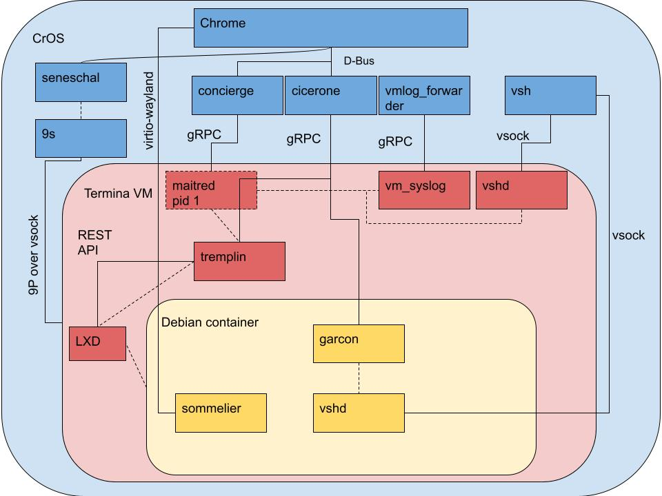

# CrostiniTips
## Tips for running linux containers (LXC) on ChromeOS via Crostini

Crostini is a system for running LXC containers on the ChromeOS operating system. Crostini was designed with a focus on insulating the operating system from attacks or exploits coming from the containers. This is great for developers who want a secure, managed, operating system; while also having access to a linux development environment.

Crostini's architecture is complex. There are several layers of virtualization technologies that are nested within each other. As well as communication and control channels that traverse layers. This document will help you understand this architecture so that you can run and troubleshoot LXC containers on ChromeOS. 

## Chrome vs Chromium and Open Source Software


## Crostini Architecture Overview


This architecture diagram from the [Crostini Developer Guide](https://chromium.googlesource.com/chromiumos/docs/+/HEAD/crostini_developer_guide.md) is important for understanding Crostini's various subsystems and how they interact. It can be read in tandem with [Running Custom Containers Under Chrome OS](https://chromium.googlesource.com/chromiumos/docs/+/HEAD/containers_and_vms.md), where the Overview sections gives a concise description of each of the subsystems.

On this chart, CrOS is ChromeOS, the host's operating system (light blue background). Termina VM (pink background) is a special, read-only, virtual machine instance that runs the LXD software that manages the LXC containers. Note it is the name of a virtual machine instance, rather than a service. In traditional terms it can be referred to as a "guest operating system."

Two important pieces, not pictured, are [crosh](https://chromium.googlesource.com/chromiumos/platform2/+/HEAD/crosh) and [crossvm](https://google.github.io/crosvm/). Crosh is a limited command-line shell that can interact with the ChromeOS operating system. It is used for launching virtual machines. Crossvm is a "virtual machine monitor". In more traditional terms it can be thought of as a [type-2](https://en.wikipedia.org/wiki/Hypervisor#Classification) hypervisor.

Debian Container (light yellow background) is an LXC container. The default LXC container in named Penguin. User-launched containers would be represented here on the diagram. The nesting hierarchy of the various virtualization environments can be confusing. This tree shows the relationships.    

```
ChromeOS
  ├── Chrome (Browser process)
  └── CrossVM (Hypervisor)
      └── Termina VM (Virtual Machine instance)
          └── LXD (Daemon)
              ├── Penguin LXC (Container)
              └── LXC 2 (Optional user-specified container)
```

[Garcon](https://chromium.googlesource.com/chromiumos/platform2/+/HEAD/vm_tools/garcon/) and [Sommelier](https://chromium.googlesource.com/chromiumos/platform2/+/HEAD/vm_tools/sommelier/) (yellow) are daemons that run inside LXC containers. They are installed with the [cros-continer-guest-tools](https://chromium.googlesource.com/chromiumos/containers/cros-container-guest-tools/+/refs/heads/main) package. They communicate directly with the operating system, crossing the isolation boundary of the virtual machine.

## cros-container-guest-tools
The [cros-continer-guest-tools](https://chromium.googlesource.com/chromiumos/containers/cros-container-guest-tools/+/refs/heads/main) enable communication between a LXC container and the ChromeOS operating system, traversing the CrosVM virtual machine boundary. These tools are installed by attaching a virtual disk inside the LXC container and mounting it at `/opt/google/cros-containers`. [lxc_setup.sh](https://chromium.googlesource.com/chromiumos/containers/cros-container-guest-tools/+/refs/heads/main/lxd/lxd_setup.sh) is run when the container is first created, which installs the `cros-guest-tools`. The guest tools are started in the lxc container via systemd unite files in `/etc/systemd/users/`.    


### Installing cros-container-guest-tools on alternative containers
Add appropriate apt repo key
Add repo
apt install cros-guest-tools
https://chromium.googlesource.com/chromiumos/containers/cros-container-guest-tools/+/refs/heads/main/lxd/lxd_setup.sh

## Getting started running custom LXC containers.
In ChromeOS settings, go to Advanced > Developers> Linux development environment and enable "Linux development environment."

In Chrome type `chrome://flags#crostini-multi-container` and enable the feature.

Restart your Chromebook.

Depending on your version of ChromeOS you may now have access to  


## Networking
Under settings you can do port forwarding.

## Files Access

## USB

## Troubleshooting
* If Linux Developer Options do not appear or the multiple container UI doesn't appear, try restarting the system. Or try disabling and re-enabling the crostini-multi-container flag, or linux development environment.

* If you are working off of tutorials, check that they are somewhat recent, ChromeOS/Crostini are developing rapidly.
___
Working below this line.

Quote: The crosh shell runs in the same environment as the browser (same user/group, same Linux namespaces, etc...). So any tools you run in crosh, or information you try to acquire, must be accessible to the chronos user.

Spent way to much time trying to determine what context crosh and crosvm work in. Crosvm implicitly needs to run in OS userpace because it uses low level kernel functions, wouldn't make sense to run under Chrome process.

Crost (?) Documentation says it runs "same env as browser" does that mean it's a sub-shell? Unclear. But doesn't matter for purposes of this doc. Could identify this easily on a rooted device.

https://chromium.googlesource.com/chromiumos/docs/+/HEAD/costini_developer_guide.md
https://chromium.googlesource.com/chromiumos/docs/+/HEAD/containers_and_vms.md
https://chromium.googlesource.com/chromium/src/+/main/chrome/browser/ash/crostini
https://chromium.googlesource.com/chromiumos/platform2/+/HEAD/vm_tools/vsh/

https://chromium.googlesource.com/chromiumos/docs/+/HEAD/dbus_in_chrome.md
https://www.chromium.org/developers/mus-ash/ - discontinued 2019

https://www.chromium.org/chromium-os/chromiumos-design-docs/boot-design/

https://chromium.googlesource.com/chromiumos/platform2/

https://chromium.googlesource.com/chromiumos/docs/+/HEAD/security/chromeos_security_whitepaper.md - Graphic clarifying OS Userspace is here.

https://www.chromium.org/chromium-os/

https://chromium.googlesource.com/chromiumos/platform2/+/HEAD/vm_tools/init/vm_concierge.conf - nsenter details

https://chromium.googlesource.com/chromiumos/containers/cros-container-guest-tools/+/refs/heads/main/lxd/lxd_setup.sh#35 -Confirms that Tremplin writes /etc/apt/sources.d/cros.list (Possible also writes sytemd unit files then?)

Original place where cros-containers repo was found.
https://www.reddit.com/r/Crostini/wiki/howto/install-behind-a-proxy
https://storage.googleapis.com/cros-containers

https://www.aboutchromebooks.com/news/chrome-os-98-adds-management-of-multiple-chromebook-linux-containers/


https://www.reddit.com/r/Crostini/comments/s31fwc/multiple_crostini_containers_can_now_run/

https://blog.simos.info/a-closer-look-at-chrome-os-using-lxd-to-run-linux-gui-apps-project-crostini/#The%20Chrome%20OS%20deb%20package%20repository

https://github.com/edeloya/ChromeOS-Terminal-LXC-LXD
https://chromium.googlesource.com/chromiumos/overlays/board-overlays/+/HEAD/project-termina/
https://medium.com/@tcij1013/lxc-lxd-cheetsheet-effb5389922d

https://wiki.archlinux.org/title/Chrome_OS_devices/Crostini
https://wiki.debian.org/LXC

https://blog.merzlabs.com/posts/crostini-now-usable/
https://blog.merzlabs.com/posts/yubikey-crostini/


https://stgraber.org/2016/03/11/lxd-2-0-blog-post-series-012/

https://linuxcontainers.org/lxd/docs/master/authentication/

## Source code for reference
https://chromium.googlesource.com/chromiumos/platform2/
https://chromium.googlesource.com/chromiumos/platform/crosvm/
https://github.com/google/crosvm

https://chromium.googlesource.com/chromiumos/platform2/+/HEAD/crosh

https://chromium.googlesource.com/chromiumos/containers/cros-container-guest-tools/


https://chromium.googlesource.com/chromiumos/platform/tremplin/
https://chromium.googlesource.com/chromiumos/overlays/board-overlays/+/main/project-termina/

https://github.com/lxc

## Remotes for LXC container images
https://us.lxd.images.canonical.com/
https://us.lxd.images.canonical.com/meta/1.0/
https://us.lxd.images.canonical.com/meta/1.0/index-system.1
https://us.lxd.images.canonical.com/meta/1.0/index-user.1
